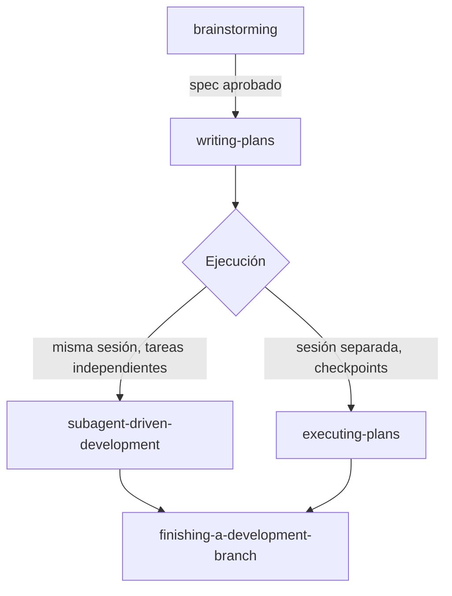

# Skills de proceso (flujo de desarrollo agéntico)

## Qué es esto

A diferencia de `backend/`, `security/`, `seo/` y `mobile/` —que son **bases de conocimiento de dominio** (un `SKILL.md` enrutador + módulos `.md` con contenido técnico)—, estas 14 carpetas sueltas en la raíz del repositorio son **skills de proceso**: reglas de disciplina y protocolos de flujo de trabajo para cómo un agente hace ingeniería de software, importadas del framework Superpowers (`using-superpowers` es el punto de entrada). No enseñan seguridad, backend ni SEO — enseñan *cómo diseñar, planear, implementar, revisar y cerrar* cualquier tarea de desarrollo.

Cada una cumple las tres condiciones de descubrimiento del repo (`SKILL.md` de primer nivel, cabecera `name`/`description`, nombre de carpeta = `name`) — verificado con `node indice/scripts/indexar.mjs --check`. `ai/` quedó reservada de nuevo para el dominio de conocimiento "Ingeniería de IA/LLMs/agentes" descrito en el roadmap del README raíz, sin relación con estas 14.

## Punto de entrada

**[`using-superpowers/`](using-superpowers/SKILL.md)** — no resuelve una tarea por sí sola; establece la regla "si una skill podría aplicar, tienes que invocarla" antes de cualquier respuesta o acción, incluidas preguntas aclaratorias. Las otras 13 skills de proceso se descubren a través de esta regla.

## El flujo principal (camino arquitectónico)

| Skill | Cuándo se dispara | Qué hace |
|---|---|---|
| [`brainstorming/`](brainstorming/SKILL.md) | Antes de cualquier trabajo creativo (nueva feature, componente, cambio de comportamiento) | Clasifica la tarea en **spike** (respuesta, no código), **bounded** (cambio acotado en flujo existente) o **architectural** (nuevo subsistema). Cada camino termina en una aprobación explícita del humano antes de implementar — nunca se salta el gate por "simple". El camino architectural termina escribiendo un spec en `docs/superpowers/specs/`. |
| [`writing-plans/`](writing-plans/SKILL.md) | Hay spec o requisitos para una tarea multi-paso, antes de tocar código | Convierte el spec en un plan de implementación en tareas de 2-5 minutos cada una (TDD, DRY, YAGNI), asumiendo que quien ejecuta no conoce el repo. Prohíbe placeholders ("TBD", "similar a la Tarea N"). Se guarda en `docs/superpowers/plans/`. |
| [`subagent-driven-development/`](subagent-driven-development/SKILL.md) | Ejecutar el plan en la sesión actual, con tareas mayormente independientes | Despacha un subagente implementador fresco por tarea + revisión de spec/calidad tras cada una + revisión final de toda la rama. Lleva un *ledger* de progreso porque el contexto no sobrevive a la compactación. Selecciona el modelo según la dificultad de cada rol. |
| [`executing-plans/`](executing-plans/SKILL.md) | Ejecutar el plan en una sesión separada, con checkpoints de revisión | Versión más simple: carga el plan, revisa críticamente, ejecuta cada tarea con sus verificaciones, se detiene ante bloqueos en vez de adivinar. |
| [`finishing-a-development-branch/`](finishing-a-development-branch/SKILL.md) | Implementación completa y tests en verde | Verifica tests → detecta si hay worktree → presenta exactamente 3 opciones (merge local / PR / dejar como está) → ejecuta la elegida → limpia el workspace. Nunca descarta trabajo sin la palabra literal "discard". |

## Skills transversales (se usan dentro de los pasos de arriba, no en secuencia)

| Skill | Se invoca cuando | Regla central |
|---|---|---|
| [`test-driven-development/`](test-driven-development/SKILL.md) | Antes de escribir cualquier código de implementación | Ciclo RED-GREEN-REFACTOR: sin test que falle primero, no hay código de producción. |
| [`systematic-debugging/`](systematic-debugging/SKILL.md) | Ante cualquier bug, test que falla o comportamiento inesperado, antes de proponer un fix | Cuatro fases obligatorias (causa raíz → patrón → hipótesis → implementación); 3+ fixes fallidos = cuestionar la arquitectura, no seguir parchando. |
| [`verification-before-completion/`](verification-before-completion/SKILL.md) | Antes de afirmar que algo "pasa", "está arreglado" o "completo" | Sin evidencia fresca de haber corrido el comando de verificación en ese mismo mensaje, no se puede hacer la afirmación. |
| [`using-git-worktrees/`](using-git-worktrees/SKILL.md) | Al iniciar trabajo que necesita aislarse de la rama actual | Detecta aislamiento existente → prefiere herramientas nativas del harness → cae a `git worktree` manual solo si no hay alternativa. |
| [`dispatching-parallel-agents/`](dispatching-parallel-agents/SKILL.md) | 2+ tareas independientes sin estado compartido | Un agente por dominio de problema, despachados en paralelo en la misma respuesta; nunca para fallos relacionados entre sí. |
| [`requesting-code-review/`](requesting-code-review/SKILL.md) | Al completar una tarea, una feature mayor, o antes de mergear | Despacha un subagente revisor con contexto preciso (nunca el historial completo de la sesión) usando la plantilla `code-reviewer.md`. |
| [`receiving-code-review/`](receiving-code-review/SKILL.md) | Al recibir feedback de revisión, antes de implementar sugerencias | Verificar contra el código real antes de actuar; prohíbe acuerdo performativo ("¡tienes toda la razón!"); permite y exige contraargumentar con razones técnicas si el feedback está mal. |
| [`writing-skills/`](writing-skills/SKILL.md) | Al crear o editar una skill | TDD aplicado a documentación: corre el escenario de presión sin la skill (RED), escribe la skill mínima que lo resuelve (GREEN), cierra vacíos de racionalización (REFACTOR). |

## Reglas comunes a todas

- **El gate de aprobación humana nunca se salta** por simplicidad — solo cambia el tamaño de la ceremonia (brainstorming).
- **Ningún subagente despacha a otro subagente** — la revisión y el fan-out son responsabilidad del agente coordinador, nunca de un implementador (subagent-driven-development).
- **Toda decisión que un agente toma en nombre del humano se registra** en un ledger o se reporta explícitamente al final ("Rulings I made") — nunca se decide en silencio.
- **Cuatro cosas, y solo esas cuatro, detienen la ejecución autónoma:** una operación irreversible/destructiva, una acción sensible a seguridad, un efecto colateral fuera del worktree (merge, push, publish), o un plan tan roto que cualquier camino es adivinar.
